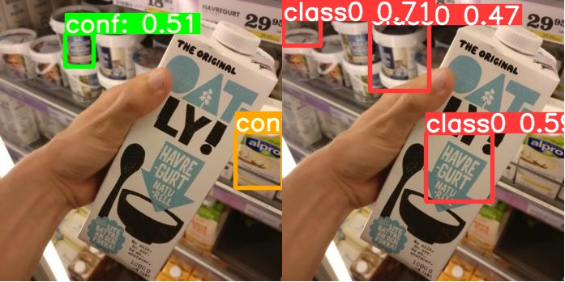

# Performance of Pre-trained Weights

| Grocery_detection weights vs Retail-store weights |
|-------------------------|
|  |

# Performance of Real-ESRGON

| Zoomed cropped image vs Enhanced image 4x |
|-------------------------|
|  |
|  |
|  |
|  |
|  |
|  |
|  |
|  |
|  |
|  |
|  |
|  |
|  |
|  |
|  |
|  |
|  |
|  |
|  |
