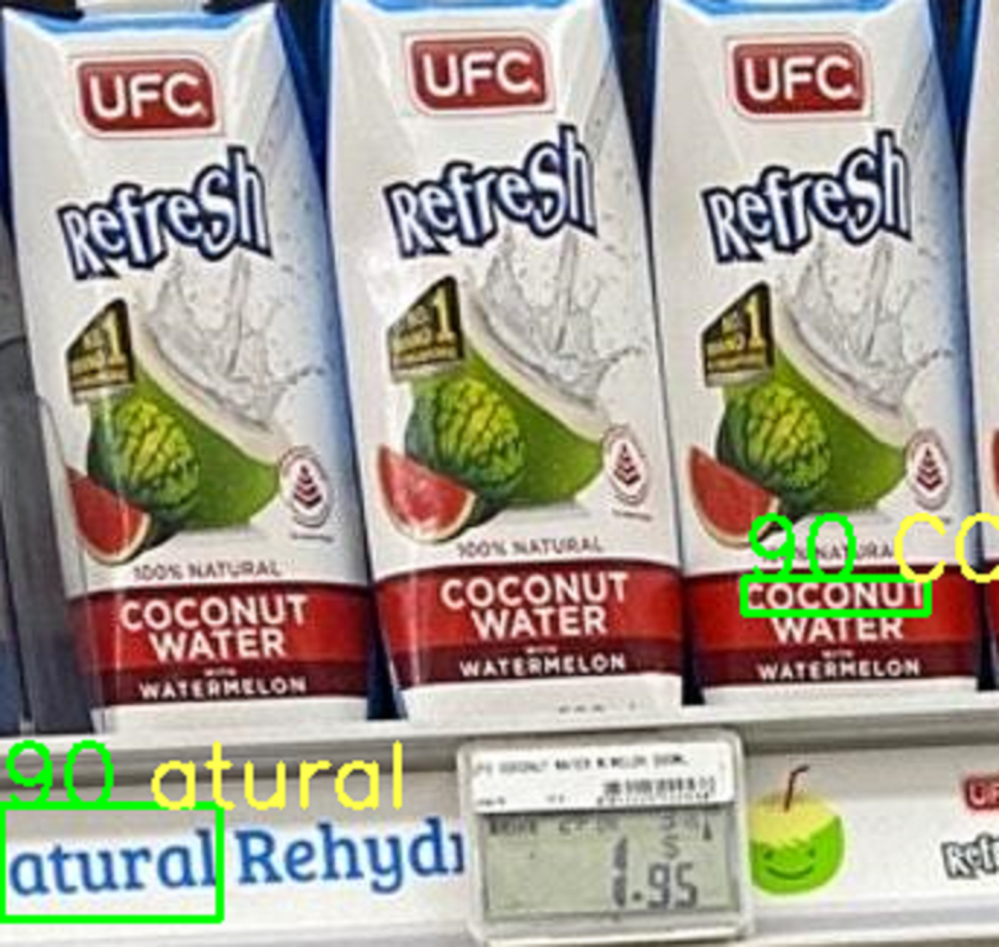

# Final Year Project - Microsoft Innovation Competition
### Title: 
Design and Development of a Smart Supermarket System
### Description:
In this project, students will look into developing a system or software application that will improve the work process and the customer experience in a supermarket. For example, an application can be created to recognize products on the supermarket shelf for planogram compliance by product classification, computer vision and deep learning approaches. Additionally, product nutrition identification can be implemented for the nutritional tracking of consumers.

# Architecture

# Proof of Concepts:

## Performance of Pre-trained Weights

| Grocery_detection weights | Retail-store weights |
|-------------------------|-------------------------|
|  |  |
|  |  |

## Performance of Real-ESRGAN

| Zoomed cropped image vs Enhanced image 4x |
|-------------------------|
|  |
<!-- |  |
|  |
|  |
|  | -->

## Performance of OCR

| OCR without ESRGAN | OCR with ESRGAN |
|-------------------------|-------------------------|
|  |  |

Credits to 
1. [YOLOv5](https://github.com/ultralytics/yolov5)
2. [Pre-trained Retail Store Item weights](https://github.com/shayanalibhatti/Retail-Store-Item-Detection-using-YOLOv5)
3. [Pre-trained Grocery detection weights](https://github.com/shreyasvedpathak/grocery-detection)
4. [xinntao on Github for Real-ESRGAN resolution enhancer](https://github.com/xinntao/Real-ESRGAN)
5. [Tesseract OCR](https://github.com/tesseract-ocr/tesseract) and [PyTesseract wrapper for Python](https://github.com/madmaze/pytesseract)
